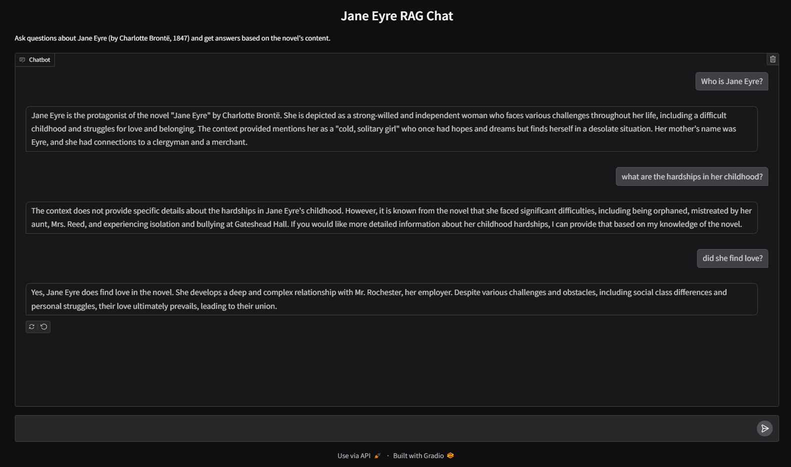
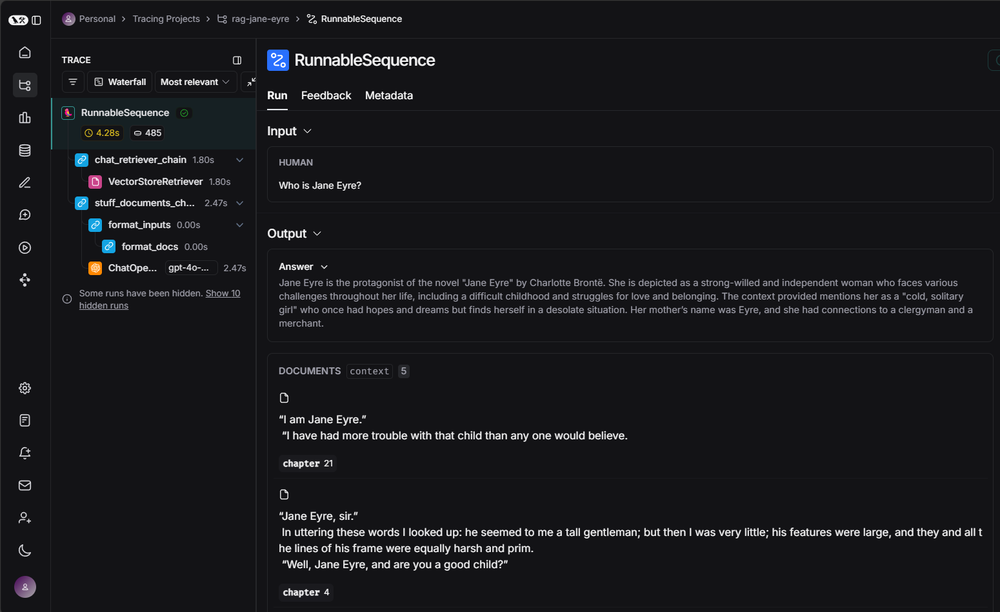

# RAG Chat - Jane Eyre
- An RAG chatbot that allows users to ask questions about Jane Eyre (by Charlotte Brontë, 1847) and get answers based on the novel's content.
- Techs used in this project: Chroma, Langchain, Gradio, and (optional) Langsmith

## View on:
- [Github](https://github.com/benizakurayana/rag-jane-eyre)
- [Hugging Face](https://huggingface.co/spaces/benizakurayana/rag-jane-eyre)  
If it says "This Space is sleeping due to inactivity," please click the "Restart this space" button

## Environment variables
- _(友善提醒：切勿將API key直接寫在程式碼中！)_
- Save these variables to a `.env` file locally, or to `Hugging Face Spaces > space settings > Variables and secrets`:
  - OPENAI_API_KEY
  - EMBEDDING_DEPLOYMENT_NAME=text-embedding-3-large
  - LLM_DEPLOYMENT_NAME=gpt-4o-mini
  - Langsmith (optional)
    - LANGCHAIN_TRACING_V2=true
    - LANGCHAIN_ENDPOINT=https://api.smith.langchain.com
    - LANGCHAIN_API_KEY
    - LANGCHAIN_PROJECT

##  Project Overview
There are two versions of app, and both versions utilize `preprocess.py` to create the Chroma vector store.
1. **Single response**
   - Files:
     - Gradio app: `app_single_response.py`
     - Respond function: `rag_respond_std_iface.py`
   - `Gradio Standard Interface` used
   - One question and one answer only, using the user input as query string directly in vector store 
   - I'd suggest to understand this version first since it's less complex than the **Chat** version  
     _(建議可以先理解此版本中的code，再去看Chat版的code)_

2. **Chat**
   - This is the actual version running on Hugging Face (HF will automatically run the file named `app.py`)
   - Files
     - Gradio app: `app.py`
     - Respond function: `rag_respond_chat_iface.py`
   - `Gradio Chat Interface` used (since we need chat history)
   - Continuous conversation, so an additional chain is added to summarize the conversation so far into a query string for the LLM   
   - For example, conversation history:   
     `
     ['what is wuthering heights?', 
      'wuthering height is...', 
      'tell me more about it']
     `  
     If we use the last sentence 'tell me more about it' to query, we won't get the correct results.

## App Screenshots
- Screenshot 1　 

 
## Langsmith traces
- Langsmith provides powerful tracing capabilities for Langchain application executions, providing insights into the performance and behavior of the application.
These traces provide valuable information about the execution flow, latency, and any errors encountered during the app's runtime.
- In app screenshot 1 above, there are three `RunnableSequence` instances invoked. You can explore the details of each trace using the following links, 
for a deeper understanding of how the Langchain flows go in this app:
  - [Trace 1](https://smith.langchain.com/public/19a999bd-376e-4ef7-bb1e-a635c8012c47/r)
  - [Trace 2](https://smith.langchain.com/public/77dc3b1b-50bc-4ff1-b2c0-c45cc551bdfc/r)
  - [Trace 3](https://smith.langchain.com/public/21f9f3b2-a977-4df1-b243-2ad985593389/r)

- Below is a screenshot of the Langsmith interface showing the traces for this app.  

## Reference
The Langchain implementation is adapted from this [Langchain tutorial article](https://python.langchain.com/docs/how_to/chatbots_retrieval/), 
with the integration of Chroma and Gradio interface added by me.
